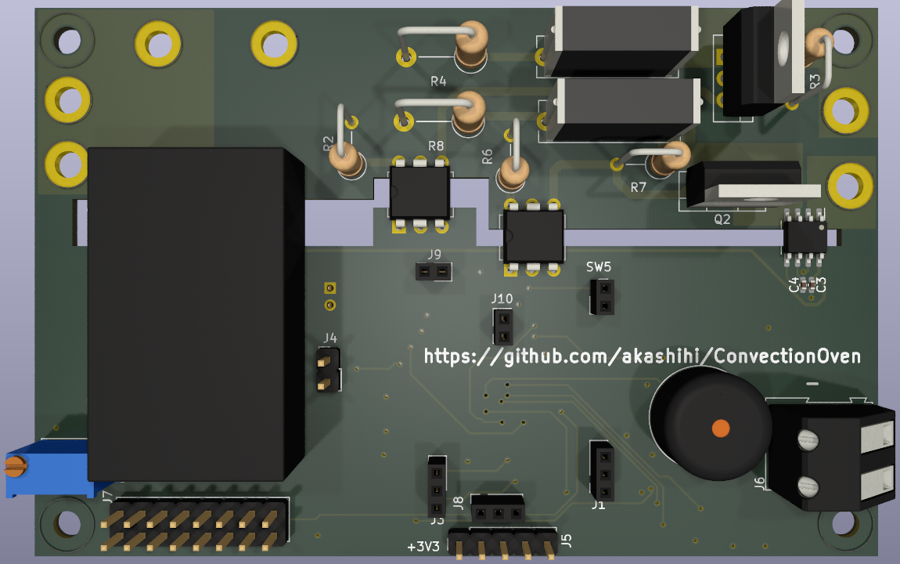

<!-- Improved compatibility of back to top link: See: https://github.com/othneildrew/Best-README-Template/pull/73 -->
<a name="readme-top"></a>


<h3 align="center">Adler Ad 6304 Convection Oven controller board</h3>
<div>
  <p align="center">
    Modern replacement for the Adler Ad 6304 control circuit. 
    <br />
    <a href="https://github.com/akashihi/ConvectionOven"><strong>Explore the docs »</strong></a>
    <br />
    <br />
  </p>
</div>


<!-- TABLE OF CONTENTS -->
<details>
  <summary>Table of Contents</summary>
  <ol>
    <li>
      <a href="#about-the-project">About The Project</a>
    </li>
    <li>
      <a href="#getting-started">Getting Started</a>
      <ul>
        <li><a href="#housing">Housing</a></li>
        <li><a href="#controls">Controls</a></li>
        <li><a href="#hall-sensor">Hall sensor</a></li>
        <li><a href="#pcb">PCB</a></li>
        <li><a href="#firmware">Firmware</a></li>
      </ul>
    </li>
    <li><a href="#usage">Usage</a></li>
    <li><a href="#roadmap">Roadmap</a></li>
    <li><a href="#contributing">Contributing</a></li>
    <li><a href="#license">License</a></li>
    <li><a href="#contact">Contact</a></li>
  </ol>
</details>


<!-- ABOUT THE PROJECT -->
## About The Project



This is a drop-in replacement of an analog control circuit of the Adler Ad 6304 oven.

The updated control circuit provides the following improvements to the original circuit:

* Easily cancellable timer
* Magnetic handle position sensor
* PID temperature control
* LCD user interface
* Overheat protection
* Motor protection (currently disabled in firmware)
* Sleeping mode (currently disabled)

<p align="right">(<a href="#readme-top">back to top</a>)</p>


<!-- GETTING STARTED -->
## Getting Started

Get an Adler Ad 6304 oven that you would like to upgrade. Broken oven is fine too, 
in case heater element and motor are still working. You will need to completely disassemble
the oven and remove most of it. However, some elements will be reused:

* Heater and heater wires
* Motor and motor wires
* Thermistor. It is hidden in the white braid and mounted directly to the upper fan housing. 
Leave it as it is or move closer to the power outlet.

Everything else, including the plastic enclosure, could be thrown to the trash :D 

### Housing

Housing consists of five 3D printable parts:

* Inner and outer axles
* Upper and lower handle parts
* The actual electronics housing

Both axles and handle parts are easy to print. The housing is more tricky, as you need 
supports only for the bigger overhands, like encoders insets or cut for a handle. 
You *do not* need supports for the ventilation cuts. Putting supports there will make your life
much harder, as those supports are almost impossible to remove.

While assembling the housing, you need to put inner axles through the housing and glue them
to the outer axles, so they will become a real axle. For the handle you'll need some M3 bolts
and nuts. Additionally, you need to put several strong 6mmx3mm magnets into the magnet
pocket of the lower handle.

After assembling the handle, put the M3 insets into the hall sensor PCB mounting holes,
screen mounting holes and the main PCB mounting holes.

As the last step, mount the IEC 60320 C14 connector to the respective slot on the housing side.

<p align="right">(<a href="#readme-top">back to top</a>)</p>

### Controls

All controls are mounted to the housing. You will need to mount:

* Two encoders, one for the temperature setting, one for the timer setting
* Two buttons. One for the sleep mode (unused atm), one to switch the cooking mode on and off
* Two LEDs, one shows whether oven is cooking or not, another one shows the heater state
* 16x2 HD44780 screen with 3.3V support. The 5V screens will not work in this design.

<p align="right">(<a href="#readme-top">back to top</a>)</p>

### Hall sensor

Hall sensor is mounted on a separate PCB under the handle. This design uses omni-polar
hall sensor with an open-drain output.

<p align="right">(<a href="#readme-top">back to top</a>)</p>

### PCB

Control PCB is a four layer PCB, split into hot side and cold side. Follow the schematics
and PCB design for the assembly. Additional guidance:

* The U3 IC is required, as it closes the motor control circuit. However, it is not
used in the firmware, so rest of the components (C3, C4, R11, R12, D1, C20) could be omitted for now.
* You can skip the U4 IC and related components (R10, C11, C6, C5)
* You need to short circuit R25, as there is no sleep mode implemented yet
* TRIACs Q1 and Q2 *require* heatsinks
* You may test the cold side of the circuit by injecting power (+5V) directly to the J4

Assembled PCB should be put into the housing and connected to the controls, power socket, heater and
motor. Please connect motor to the control channel equipped with a current sensor. It
is recommended to have a fuse between the power socket and the control PCB. Same way
connect the thermistor, mentioned above, in series with the fuse.

<p align="right">(<a href="#readme-top">back to top</a>)</p>

### Firmware

Precompiled firmware is provided in the `fw.bin` file. 

The firmware is written in Rust and could be compiled with the following commands:

```shell
cargo build --release
cargo objcopy --release --bin fw -- -O binary fw.bin
```

You can upload the firmware with a `st-flash` tool:

```shell
st-flash erase 
st-flash write fw.hex 0x8000000
st-flash reset
```

The oven should start immediately after reset

<p align="right">(<a href="#readme-top">back to top</a>)</p>

## Usage

To start cooking you have to set a timer (up to 3 hours) and desired temperature (up to 250 degrees),
lower the handle and press cooking button. The oven will start immediately.

Raising the handle or pressing the cooking button stops the motor and heater instantly.

You can adjust the timer and desired temperature during the cooking. In one minute before
the timer expiration you will get a short beep accompanied by a longer beep after timer
expiration.

After cooking please immediately open the oven and put a top lid on the lid rack to 
avoid circuit overheat.  

<p align="right">(<a href="#readme-top">back to top</a>)</p>


<!-- ROADMAP -->
## Roadmap

- [ ] Implement sleep mode
- [ ] Implement motor protection

<p align="right">(<a href="#readme-top">back to top</a>)</p>

<!-- CONTRIBUTING -->
## Contributing

Contributions are what make the open source community such an amazing place to learn, inspire, and create. Any contributions you make are **greatly appreciated**.

If you have a suggestion that would make this better, please fork the repo and create a pull request.


1. Fork the Project
2. Create your Feature Branch (`git checkout -b feature/AmazingFeature`)
3. Commit your Changes (`git commit -m 'Add some AmazingFeature'`)
4. Push to the Branch (`git push origin feature/AmazingFeature`)
5. Open a Pull Request

<p align="right">(<a href="#readme-top">back to top</a>)</p>


<!-- LICENSE -->
## License

Distributed under the GPLv3 License. See `LICENSE.txt` for more information.

<p align="right">(<a href="#readme-top">back to top</a>)</p>


<!-- CONTACT -->
## Contact

Denis Chaplygin - @akashihi@mathstodon.xyz - akashihi@gmail.com

Project Link: [https://github.com/akashihi/ConvectionOven](https://github.com/github_username/repo_name)

<p align="right">(<a href="#readme-top">back to top</a>)</p>
